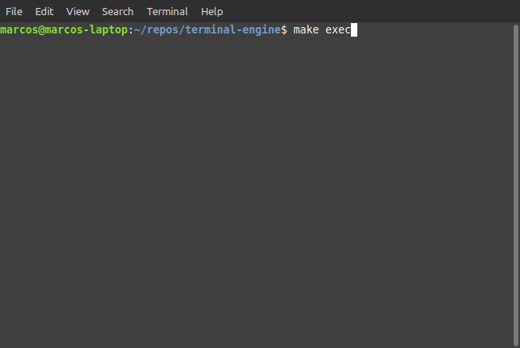

# Terminal Engine

Personal project of a terminal game engine that supports mouse input. In the future I also want to use it for 3D rendering in the terminal.

## Current State

gif demo of current state of the engine:

